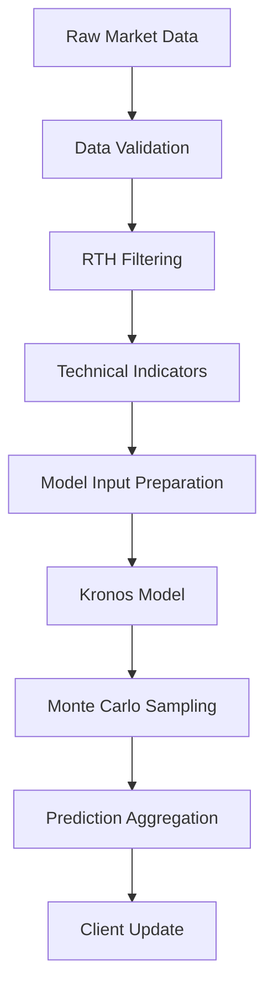

# Kronos Live Prediction Chart

Real-time financial prediction visualization system using the Kronos model with TradingView Lightweight Charts. Supports stocks (QQQ, SPY, AAPL, etc.) and cryptocurrencies (BTC/USD, ETH/USD, etc.) with live WebSocket streaming and interactive charting.

## 🚀 Features

- **Multi-Asset Support**: Stocks, ETFs, and cryptocurrencies
- **Real-time Streaming**: Live WebSocket data from Alpaca Markets
- **Interactive Charts**: TradingView Lightweight Charts with candlesticks and prediction overlays
- **Confidence Bands**: Prediction uncertainty visualization (10th, 25th, 75th, 90th percentiles)
- **Technical Indicators**: VWAP, Bollinger Bands, and Simple Moving Averages (SMA 5, 21, 233)
- **Statistics Panel**: Live metrics including probability up/down, expected return, and confidence intervals
- **Responsive Design**: Works on desktop and mobile devices
- **Graceful Fallbacks**: Historical data mode when real-time streaming is unavailable

## 📋 Prerequisites

- Python 3.8+
- CUDA-capable GPU (recommended for Kronos model)
- Alpaca API credentials (configured in `../config.yaml`)
- Kronos model checkpoint (located in `../Kronos/`)

## ⚙️ Installation

1. Navigate to the live_chart_prediction directory:
```bash
cd live_chart_prediction
```

2. Install Python dependencies:
```bash
pip install -r requirements.txt
```

## 🔧 Configuration

The service uses the parent directory's `config.yaml` file:

```yaml
# Trading Symbol
symbol: "QQQ"

# Data Parameters
data:
  lookback_bars: 480      # Context window (8 hours of 1-min bars)
  horizon: 30            # Prediction horizon (30 minutes)
  days_to_fetch: 10      # Historical data to fetch
  timeframe: "1Min"      # Bar interval
  rth_only: true         # Regular Trading Hours only

# Model Configuration
model:
  checkpoint: "NeoQuasar/Kronos-small"
  tokenizer: "NeoQuasar/Kronos-Tokenizer-base"
  device: "cuda:0"
  max_context: 512

# Sampling Parameters
sampling:
  n_samples: 100         # Monte Carlo samples
  temperature: 1.0       # Sampling temperature
  top_p: 0.9            # Nucleus sampling

# Alpaca API Configuration
alpaca:
  # Single switch for market data: use SIP/live feed when true, IEX/paper feed when false
  use_live_data: true
  # Optional: trading environment if you later place orders (does not affect data feed)
  account_env: "paper"   # "paper" | "live"
```

## 🏃‍♂️ Running the Application

1. Start the FastAPI server:
```bash
python main.py
```

2. Open your browser and navigate to:
```
http://localhost:5001
```
(Note: Port changed from 5000 to 5001 to avoid conflicts)

## 🏗️ Architecture

### Project Structure
```
live_chart_prediction/
├── main.py                   # FastAPI server with native WebSocket support
├── prediction_service.py     # Kronos model integration & prediction logic
├── websocket_manager.py      # Real-time data streaming from Alpaca
├── templates/
│   └── index.html           # Main chart interface
├── static/
│   ├── js/
│   │   └── chart.js        # Chart logic and WebSocket client
│   └── css/
│       └── style.css       # Dark theme styling
├── test_api.py              # API testing utilities
├── test_chart.html          # Chart testing page
├── check_data.py            # Data validation utilities
├── requirements.txt         # Python dependencies
└── README.md               # This documentation
```

### Component Overview

#### 1. FastAPI Server (`main.py`)
- **WebSocket Management**: Native FastAPI WebSocket support for real-time communication
- **API Endpoints**: RESTful endpoints for data retrieval and chart initialization
- **Connection Manager**: Handles multiple concurrent WebSocket connections
- **Error Handling**: Graceful error handling with client notifications

#### 2. Prediction Service (`prediction_service.py`)
- **Model Integration**: Loads and manages Kronos model checkpoints
- **Data Processing**: Fetches and preprocesses market data from Alpaca
- **Prediction Generation**: Monte Carlo sampling for prediction uncertainty
- **Technical Analysis**: VWAP and Bollinger Band calculations
- **Symbol Management**: Dynamic symbol switching (stocks and crypto)

#### 3. WebSocket Manager (`websocket_manager.py`)
- **Multi-Asset Streaming**: Handles both stock and crypto WebSocket streams
- **Data Feed Selection**: IEX vs SIP via `alpaca.use_live_data`
- **Connection Reliability**: Persistent background threads with error handling
- **Fallback Mechanisms**: Graceful degradation to historical data mode (optional)
- **Error Recovery**: Automatic reconnection and error notification

#### 4. Frontend (`static/js/chart.js`)
- **TradingView Integration**: Lightweight Charts library implementation
- **Real-time Updates**: WebSocket client for live data streaming
- **Interactive Controls**: Symbol selection, timeframe switching, indicator toggles
- **Responsive Design**: Mobile-friendly chart interface
- **State Management**: Chart state persistence and update handling

## 📊 Data Pipeline

### 1. Data Acquisition
```
Alpaca Markets API → WebSocket Manager → Prediction Service
```

**Sources:**
- **Stocks/ETFs**: IEX feed (`use_live_data: false`) / SIP feed (`use_live_data: true`)
- **Cryptocurrencies**: Alpaca crypto feed
- **Historical Data**: REST API for initial chart population

**Data Types:**
- 1-minute OHLCV bars
- Real-time trades (optional)
- Market status and trading hours

### 2. Data Processing Pipeline



#### Step-by-Step Process:

1. **Data Validation** (`prediction_service.py:162-170`)
   - Timestamp validation
   - OHLCV data integrity checks
   - Missing data handling

2. **RTH Filtering** (`prediction_service.py:171-175`)
   - Regular Trading Hours: 9:30 AM - 4:00 PM ET
   - Removes pre/post-market data for stocks
   - Crypto trades 24/7 (no filtering)

3. **Technical Indicators** (`prediction_service.py:300-450`)
   - **VWAP**: Volume-weighted average price (last 20 bars)
   - **Bollinger Bands**: 20-period SMA ± 2 standard deviations
   - **Simple Moving Averages**:
     - SMA 5 (orange): Short-term trend indicator
     - SMA 21 (red): Medium-term trend indicator
     - SMA 233 (grey): Long-term trend indicator

4. **Model Input Preparation** (`prediction_service.py:200-250`)
   - Lookback window: 480 bars (8 hours)
   - Price normalization
   - Feature engineering
   - Tokenization for Kronos model

5. **Prediction Generation** (`prediction_service.py:400-500`)
   - Monte Carlo sampling: 100 samples by default
   - Temperature-controlled sampling: 1.0
   - Horizon: 30 minutes (30 bars)
   - Confidence interval calculation

### 3. Real-time Data Flow

```
Market Data → Alpaca API → WebSocket Manager → FastAPI → Frontend Chart
                    ↓
               Prediction Service → Kronos Model → Predictions → Frontend
```

**Update Triggers:**
- New market data received via WebSocket
- User symbol change
- Manual refresh request
- Periodic prediction regeneration

**Latency Optimization:**
- Non-blocking WebSocket connections
- Asynchronous prediction generation
- Client-side chart caching
- Background model loading

## 🔌 API Reference

### REST Endpoints

#### `GET /`
Returns the main chart interface (HTML).

#### `GET /api/initial_data`
Fetches initial historical data and latest prediction.

**Response:**
```json
{
  "historical": [
    {
      "timestamp": "2024-01-01T14:30:00Z",
      "open": 400.50,
      "high": 401.20,
      "low": 400.10,
      "close": 400.80,
      "volume": 1000000
    }
  ],
  "prediction": {
    "mean_path": [400.85, 400.90, 401.00],
    "confidence_bands": {
      "p10": [400.70, 400.75, 400.80],
      "p90": [401.00, 401.05, 401.20]
    },
    "probability_up": 0.65,
    "expected_return": 0.125
  },
  "timestamp": "2024-01-01T14:30:00Z"
}
```

#### `GET /api/latest_prediction`
Gets the current prediction without historical data.

#### `POST /api/start_stream`
Starts WebSocket streaming for a symbol.

**Request:**
```json
{
  "symbol": "BTC/USD",
  "timeframe": "1Min"
}
```

#### `POST /api/stop_stream`
Stops current WebSocket stream.

#### `GET /api/generate_prediction`
Generates a new prediction on demand.


### WebSocket Events

#### Client → Server

**`request_update`**: Request manual prediction update
```json
{
  "type": "request_update"
}
```

**`settings_changed`**: Symbol or timeframe change
```json
{
  "type": "settings_changed",
  "ticker": "SPY",
  "timeframe": "5Min"
}
```

**`check_for_new_data`**: Check for new market data
```json
{
  "type": "check_for_new_data"
}
```

#### Server → Client

**`connected`**: Connection established
```json
{
  "type": "connected",
  "message": "Connected to prediction server"
}
```

**`prediction_update`**: New prediction available
```json
{
  "type": "prediction_update",
  "prediction": { /* prediction data */ },
  "historical": [ /* optional historical data */ ],
  "timestamp": "2024-01-01T14:30:00Z"
}
```

**`stream_started`**: WebSocket stream initiated
```json
{
  "type": "stream_started",
  "symbol": "BTC/USD",
  "timeframe": "1Min"
}
```

**`stream_error`**: Streaming error with fallback
```json
{
  "type": "stream_error",
  "message": "Crypto streaming unavailable",
  "fallback": true,
  "suggestion": "Using historical data mode"
}
```

## 🔧 Customization

### Model Parameters

Edit prediction parameters in `config.yaml`:

```yaml
sampling:
  n_samples: 200        # More samples = higher accuracy, slower generation
  temperature: 0.8      # Lower = more conservative predictions
  top_p: 0.95          # Nucleus sampling threshold

model:
  checkpoint: "NeoQuasar/Kronos-base"  # Use larger model
  max_context: 1024     # Longer context window
```

### Chart Appearance

Modify chart styling in `static/js/chart.js`:

```javascript
const chartOptions = {
    layout: {
        backgroundColor: '#1e222d',    // Dark background
        textColor: '#d1d4dc',         // Light text
    },
    grid: {
        vertLines: { color: '#2e3442' },
        horzLines: { color: '#2e3442' }
    },
    timeScale: {
        timeVisible: true,
        secondsVisible: false
    }
};

// SMA colors
indicatorSeries.sma5 = chart.addLineSeries({
    color: '#FF8C00',    // Orange
    lineWidth: 2,
    title: 'SMA 5',
});

indicatorSeries.sma21 = chart.addLineSeries({
    color: '#FF0000',    // Red
    lineWidth: 2,
    title: 'SMA 21',
});

indicatorSeries.sma233 = chart.addLineSeries({
    color: '#808080',    // Grey
    lineWidth: 3,
    title: 'SMA 233',
});
```

### Update Frequency

Adjust prediction generation frequency in `prediction_service.py`:

```python
# Generate predictions every N seconds
PREDICTION_INTERVAL = 30  # seconds
```

### Symbol Configuration

Add new symbols in `templates/index.html`:

```html
<select id="ticker-select">
    <optgroup label="Stocks">
        <option value="QQQ">QQQ</option>
        <option value="SPY">SPY</option>
        <option value="YOUR_SYMBOL">Your Symbol</option>
    </optgroup>
</select>
```

## 🐛 Troubleshooting

### Common Issues

#### 1. Application Hanging
**Symptoms**: Server becomes unresponsive when selecting symbols or refreshing
**Solution**: Fixed in latest version with non-blocking WebSocket implementation
- Check WebSocket connections in browser dev tools
- Restart server if persistent

#### 2. GPU Memory Issues
**Symptoms**: CUDA out of memory errors
**Solutions**:
- Reduce `n_samples` in config (e.g., 50 instead of 100)
- Use smaller model: `Kronos-mini` instead of `Kronos-base`
- Close other GPU applications

#### 3. No Data Showing
**Symptoms**: Empty charts or "No data available"
**Checklist**:
- ✅ Alpaca API credentials in `../config.yaml`
- ✅ Market hours (9:30 AM - 4:00 PM ET for stocks)
- ✅ Internet connection
- ✅ Server logs for API errors

#### 4. WebSocket Connection Errors
**Symptoms**: Real-time updates not working
**Solutions**:
- Check browser console for WebSocket errors
- Verify firewall allows port 5001
- Try different browser or incognito mode
- Check Alpaca API key permissions

#### 5. Crypto Streaming Issues
**Symptoms**: BTC/USD selection causes problems
**Solutions**:
- Live crypto streaming requires `use_live_data: true` and proper data entitlements
- Application may fall back to historical data mode if feed is unavailable
- Check logs for authentication/entitlement errors

#### 6. Missing Predictions or SMAs
**Symptoms**: Prediction statistics showing empty or SMAs not displaying
**Solutions**:
- Check server logs for SMA calculation errors
- Ensure sufficient historical data is loaded (min 233 bars for SMA 233)
- Verify model checkpoint is accessible and loaded correctly
- Check browser console for JavaScript errors
- Try refreshing the page or restarting the server

#### 7. SMA Display Issues
**Symptoms**: Simple Moving Averages not showing on chart
**Solutions**:
- Use "Toggle SMAs" button to enable/disable SMA display
- Check that SMA calculations are working in server logs
- Verify chart has enough historical data points
- Expected colors: SMA5 (orange), SMA21 (red), SMA233 (grey)

### Performance Optimization

#### For Development
```bash
# Run with debug logging
python main.py --log-level DEBUG

# Use CPU instead of GPU (slower but uses less memory)
# Edit config.yaml: device: "cpu"
```

#### For Production
```bash
# Use production ASGI server
pip install gunicorn uvloop
gunicorn main:app -w 4 -k uvicorn.workers.UvicornWorker --bind 0.0.0.0:5001

# Enable CORS for specific domains only
# Edit main.py: allow_origins=["https://yourdomain.com"]
```

## 📝 Recent Updates

### Version 2.1.0 (Latest)
- ✅ **Simple Moving Averages**: Added SMA 5 (orange), SMA 21 (red), SMA 233 (grey)
- ✅ **OHLC Price Overlay**: Interactive price display with crosshair tracking
- ✅ **Enhanced Data Loading**: Increased historical data from 3 to 10 days
- ✅ **Fixed Prediction Generation**: Resolved SMA calculation breaking predictions
- ✅ **Improved Error Handling**: Better logging and error recovery for SMA calculations
- ✅ **Port Configuration**: Default port changed to 5001 to avoid conflicts

### Version 2.0.0
- ✅ **Fixed hanging issues**: Persistent background WebSocket connections
- ✅ **Multi-asset support**: Stocks and cryptocurrencies
- ✅ **Improved error handling**: Graceful fallbacks to historical data
- ✅ **Enhanced WebSocket management**: Separate handlers for crypto vs stocks
- ✅ **Better user feedback**: Real-time status notifications
- ✅ **Configuration fixes**: Single switch `use_live_data` for feed selection

### Migration from Flask to FastAPI
- Native WebSocket support (no more Socket.IO dependency)
- Improved async/await patterns
- Better error handling and client notifications
- Enhanced real-time performance

## 🧪 Testing

### Manual Testing
```bash
# Test API endpoints
python test_api.py

# Test chart functionality
open test_chart.html

# Validate data pipeline
python check_data.py
```

### Browser Testing
1. Open browser developer tools
2. Navigate to http://localhost:5001
3. Check WebSocket connections in Network tab
4. Monitor console for JavaScript errors
5. Test symbol switching and refresh functionality

## 🚀 Deployment

### Local Development
```bash
python main.py
# Access at http://localhost:5001
```

### Production Deployment
```bash
# Install production dependencies
pip install gunicorn uvloop

# Run with Gunicorn
gunicorn main:app -w 4 -k uvicorn.workers.UvicornWorker --bind 0.0.0.0:5001

# Or use Docker
docker build -t kronos-chart .
docker run -p 5001:5001 kronos-chart
```

### Environment Variables
```bash
export ALPACA_KEY_ID="your_key_id"
export ALPACA_SECRET_KEY="your_secret_key"
export KRONOS_MODEL_PATH="/path/to/model"
export CUDA_VISIBLE_DEVICES="0"
```

## 🔮 Future Enhancements

### Planned Features
- [ ] **Multi-timeframe support**: 5m, 15m, 1h, 1d charts
- [ ] **Portfolio tracking**: Multiple symbol monitoring
- [ ] **Alert system**: Price and prediction-based alerts  
- [ ] **Historical backtesting**: Prediction accuracy analysis
- [ ] **Mobile app**: React Native or Flutter implementation
- [ ] **Advanced indicators**: RSI, MACD, Fibonacci retracements
- [ ] **Paper trading integration**: Execute trades based on predictions
- [ ] **News sentiment analysis**: Incorporate news data into predictions

### Technical Improvements
- [ ] **Model ensemble**: Combine multiple Kronos checkpoints
- [ ] **Caching layer**: Redis for prediction and data caching
- [ ] **Database integration**: PostgreSQL for historical storage
- [ ] **Load balancing**: Multiple server instances
- [ ] **Monitoring**: Prometheus metrics and Grafana dashboards

## 📄 License

This project uses TradingView Lightweight Charts (Apache 2.0 License).
Kronos model usage subject to model license terms.

## 🤝 Contributing

1. Fork the repository
2. Create feature branch (`git checkout -b feature/amazing-feature`)
3. Commit changes (`git commit -m 'Add amazing feature'`)
4. Push to branch (`git push origin feature/amazing-feature`)
5. Open a Pull Request

## 📧 Support

For issues and questions:
- Check troubleshooting section above
- Review server logs for error details
- Open GitHub issue with reproduction steps
- Include browser console logs and server output

---

**Built with ❤️ using FastAPI, TradingView Charts, and the Kronos Model**
